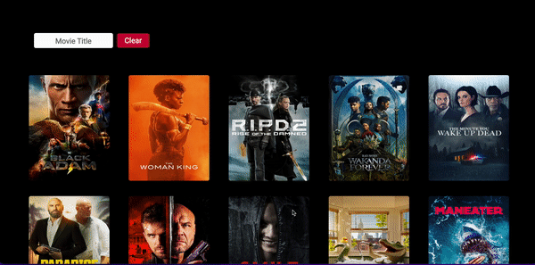
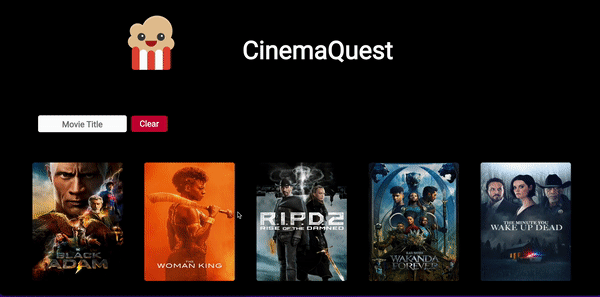

## CinemaQuest/ Rancid Tomatillos / 45 hours group project 

The learning goals of this project are...
- To gain competency with React Fundamentals
- To learn and test React components and their lifeCycle methods
- To create a multi-page experience using Router 

## Motivation
It's always difficult to pick out a movie for movie night. CinemaQuest is an application with a user-friendly interface that offers a solution. A user has the ability to see a page with forty movie poster options available. If a movie becomes of interest to our user, the person can then click on the associated movie poster and be routed to a single movie view giving the user details about that specified movie. To further advance the user experience CinemaQuest implements a search bar to streamline the movie vetting process.  
 
## Screenshots / deployment link if applicable

## Tech/framework used
- React 
- Cypress (testing)
- Router 
- CSS, HTML, JavaScript
- ProtoType (testing params)
- JSX

## Features
Our project provides...
- A user can enter the site and see a display of movie posters with titles
- A user can click on a movie poster and be shown a single movie display
- In the single movie display vital movie information will be given. Such as: OverView, title, runtime, and ratings 
- A user has the option to click back out of the single movie and see all the movie options again 
- A user has the ability to streamline their search with a search bar that will show movies that includes certain words in realtime. 
- If no movies could be found specified from user than the user will be notified of the limitation
- If a user tried to access a page outside of the project lines an error message will be displayed guiding the user back to the heart of the application
- Upon load a user will be notified that the page is building. 

## Installation
Visit the project repository CinemaQuest 
- copy / clone repo
- go into terminal -- mkdir folder- cd folder 
- run git clone [....]
- cd into project 
- run NPM start .. should see message that project is running on local host
- while keeping terminal running, open up browser and see the project deployed 

## API Reference

- single movie Data was used dynamically to get respective film information 

## Tests
- run npm i -D cypress to make sure dependency is added
- open cypress with npx cypress open 
- ex. A user should be able to visit the page and see a display of 40 movies-- should be green showing passing test. 
##   Experience time frame Project type 
 CinemaQuest is a paired Project. 
 we have been in Turing students frontend
 Andrew  C : 6 months 1 week
 Blanche H : 4 months 1 week
 
 gitHubs: 
 
 

## Future extension
- Adding a trailer video for each movie card 
- Adding more movies to better the experience
- Being able to separate the movies by genres 

## challenges & Wins
Challenges:

- First time exploring a project using React
- Implementing Router instead of the previous conditional rendering
- Having a error page shown if the user went down a bad path
- Implementing a search bar.. not just filtering the movies but also showing the user a message that their movie was not on file
- Cypress testing as new software and we had to learn how to implement. 
- Balancing time commitment across two different timeZones: Eastern and Mountain
- Using methods to track and update state across components. 

Wins: 

- Completed project in 1 week
- Implemented search functionality to filter movies by titles
- Implemented Router
- Implemented many error messages for the user to easily understand
- Implemented a new testing software 
